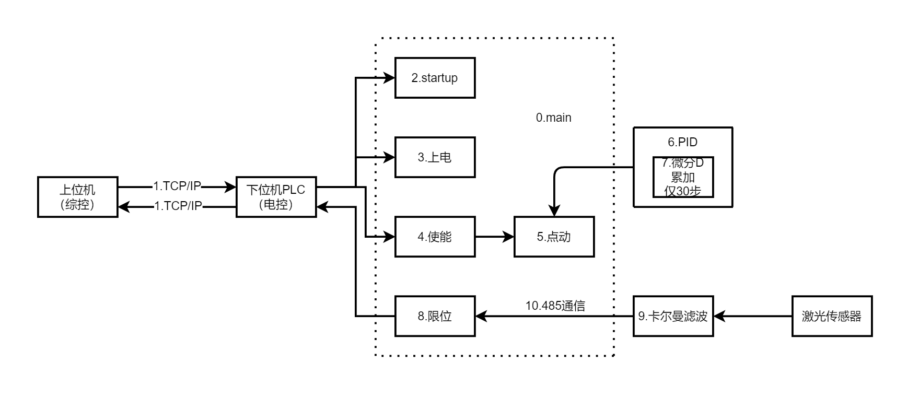

    
        S7-1200 PLC 电控学习笔记
    

    针对“S7-1200(main)”视频课程及个人总结

## 0.结构基础

    

&emsp;&emsp;（0）main：驱动所有程序块的主要代码，与上位机通讯主要使用TCP/IP协议。

&emsp;&emsp;（1）TCP：该程序块为TCP/IP通讯协议。

&emsp;&emsp;（2）startup：该程序块为每次上电后接收上一次下电的位置信息。

&emsp;&emsp;（3）上电：该程序块为控制IO端口开启或关闭。

&emsp;&emsp;（4）伺服电机使能(Servo Motor Enable)：该程序块是指通过特定的信号或电路将伺服电机启用或禁用。

&emsp;&emsp;（5）点动控制：主要为二维（x,y）点动控制，共有两种控制方法，即速度控制与位置控制。

&emsp;&emsp;（6）PID控制

&emsp;&emsp;（7）累加30步：该程序块实现仅累加30步。

&emsp;&emsp;（8）限位：该程序块为通过激光传感器传输的信号对机械运动的行程进行限定。

&emsp;&emsp;（9）卡尔曼滤波

&emsp;&emsp;（10）485通信：该程序块为485通信协议。

## 1.绪论（第一节）
&emsp;&emsp;[西门子股份公司](https://www.siemens.com/cn/zh.html)是一家专注于工业、基础设施、交通和医疗领域的科技公司。从更高效节能的工厂、更具韧性的供应链、更智能的楼宇和电网，到更清洁、更舒适的交通以及先进的医疗系统，西门子致力于让科技有为，为客户创造价值。通过融合现实与数字世界，西门子赋能客户推动产业和市场变革，帮助数十亿计的人们，共创每一天。

&emsp;&emsp;其中，S7-1200与S7-200SMART是现今西门子应用小型的自动化离散控制系统中的主要两款控制器。

    

| 硬件结构 | S7-200SMART | S7-1200 |
| :--------: |:--------: | :--------: |
| 集成通信口 | 以太网接口+RS485 | 以太网接口 |
| 信号板扩展（SB） | 支持 | 支持 |
| 最大扩展模块数 | 6个扩展模块 | 8个信号模块+3个通信模块 |
| 模拟量输入输出 | 不自带 | 自带2路模拟量输入功能 |
| 数字量输入 | 支持源型/漏型接法 | 支持源型/漏型接法 |
| 数字量输出 | 输出高电平信号 | 输出高电平信号 |

| 功能与程序结构 | S7-200SMART | S7-1200 |
| :--------: | :--------: | :--------: |
| 通信能力 | 支持S7、open、Modbus通信，DP从站、profinet通信 | 除S7-200SMART所支持的功能外，还可支持远程I/O，DP主站通信等 |
| 高速脉冲输出功能 | 支持3轴高速脉冲输出 | 支持4轴高速脉冲输出 |
| 过程控制功能 | 最多支持8个PID | 最多支持16个PID |
| 运算速度 | 0.15微秒 | 0.08微秒 |
| 数据断电保持方面 | 10KB的保存性储存器 | 10KB的保存性储存器 |
| 程序块 | 主程序、子程序、中断程序 | OB块、FB块、FC块、DB块 |
| 数据类型 | 只有基本的数据类型 | 除基本数据类型之外还有一些复杂的数据类型，参数数据类型等 |

&emsp;&emsp;TIA 博途软件将所有的自动化软件工具都统一到一个开发环境中，可以在统一开发环境组合几乎所有的西门子可编程控制器、人机界面和驱动装载。

    

&emsp;&emsp;全部技术可见官方文件[S7-1200 PLC 技术手册 EasyPlus](https://s7-1200plc-easyplus.readthedocs.io/zh-cn/sphinx-doc/index.html)

### 1.1 硬件介绍（第二节）

    

&emsp;&emsp;型号CPU xxxxC：紧凑型

&emsp;&emsp;DC/DC/DC：直流24V

&emsp;&emsp;AC/DC/xx：交流220V（RLY主要影响触点的带载能力）

&emsp;&emsp;CPU控制方式有以下分类：

    

&emsp;&emsp;工作存储组：相当于计算机的RAM，程序运算在工作存储区。

&emsp;&emsp;装载存储区：相当于计算机的ROM，程序保存在装载存储区。

&emsp;&emsp;保持性存储区：针对断电保持的数据存储。

&emsp;&emsp;远程I/O和扩展的数据走的都是过程映像区。

    

&emsp;&emsp;信号模块：数字量输入输出模块、模拟量输入输出模块统称信号模块，在PLC右侧扩展。

    

&emsp;&emsp;信号板、通信模块及信号模块扩展均可查询[S7-1200 PLC 产品手册](https://strcsstatic.blob.core.chinacloudapi.cn/downloadcenterproduction/Upload/DocFiles/20096/3401/tb/4080_2023.pdf
)。

    

&emsp;&emsp;在组装的PLC右上角可以看到S7-1200字样，代表着该PLC为S7-1200类控制器；

&emsp;&emsp;在组装的PLC右侧中间可以看到CPU 1214C DC/DC/DC字样，代表着该CPU型号为紧凑型代码1214，使用直流24V电源供电；

&emsp;&emsp;在拆解后的PLC图中可以看到，中间部位可以扩展信号板，左侧部位已经扩展一块CM 1241通信模块，用于RS232通信。

### 1.2 TIA博图软件的基本使用（第三节）

&emsp;&emsp;本项目教研室使用TIA Portal V15.1软件，打开软件后呈现初始Portal视图（如下图所示），可点击右侧中部“创建”按钮创建新项目。

    

&emsp;&emsp;创建新项目或打开历史项目后，则呈现如下图所示页面，可点击中间下部“打开项目视图”按钮或左下角“项目视图”按钮跳转至项目视图。

    

&emsp;&emsp;初始项目如下图所示。

    

&emsp;&emsp;点击“设备”栏“项目名称”下属的“添加新设备”按钮，可根据自身需要选择CPU（如下图所示）。组内裕富一块CPU 1214C DC/DC/DC PLC（214-1AG40-0XB0），可进行调试学习。

    

&emsp;&emsp;选择CPU后，软件会自动生成CPU信息（如下图所示）。从该CPU可以看出，该CPU可在左侧扩展3块通信模块、中间扩展1块信号板、右侧扩展8块信号模块。从右侧“硬件目录”框下可以拉取所需要扩展的模块。组内配套通信模块为CM 1241（241-1AH32-0XB0）以进行RS232通信。

    

&emsp;&emsp;程序主要可以通过“设备”栏“项目名称”下属的“程序块”进行查看，初始只有一个“main”程序块（如下图所示）。点击“添加新块”按钮，可以添加新的程序块。程序块主要分为四类：OB组织块、FB函数块、FC函数、DB数据块。可用三种语言编写：LAD、FBD、SCL。

    

### 1.3 S7-1200 PLC 基础知识（第四节）

&emsp;&emsp;存储区地址分类：

| 存储区 | 说明 |
| :--------: | :--------: |
| 过程映像输入（I） | 从扫描周期开始从物理输入复制（按钮） |
| 物理输入（I_:P）| 立即读取CPU的SB和SM的物理输入点 |
| 过程映像输出（Q） | 在扫描周期开始后复制到物理输出 |
| 物理输出（Q_:P）| 立即写入CPU、SB、SM上的物理输出点 |
| 位存储器（M） | 控制盒数据存储器（中间继电器） |
| 临时存储区（L） | 存储块的临时数据，这些数据仅在该块本地范围有效 |
| 数据块（DB） | 数据存储器，同时也是FB的参数存储器 |

&emsp;&emsp;寻址方式：

&emsp;&emsp;&emsp;&emsp;8位=1字节&emsp;16位=1字&emsp;32位=双字

&emsp;&emsp;&emsp;&emsp;I0.0~I0.7 IB0

&emsp;&emsp;&emsp;&emsp;I1.0~I1.7 IB1

&emsp;&emsp;&emsp;&emsp;TB0和IB1 IW0

&emsp;&emsp;&emsp;&emsp;IW0和IW2 ID0

&emsp;&emsp;&emsp;&emsp;FC块里面用形参，FC外用实参

&emsp;&emsp;数据类型用于指定数据元素的大小和格式，在定义变量时需要设置变量的数据类型，在使用指令、函数、函数块时，需要按照操作数要求的数类型使用合适的变量。

&emsp;&emsp;S7-1200中CPU的数据类型分为以下：基本数据类型、复杂数据类型、PLC数据类型（UDT）、VARIANY数据类型、系统数据类型、硬件数据类型。

<table>
  	<tr>
		<td align="center" >名称</td>
		<td align="center" >数据类型</td>
        <td align="center" >大小（bit）</td>
        <td align="center" >范围</td>
        <td align="center" >常量输入实例</td>
	</tr>
	<tr>
		<td align="center"  rowspan="5">无符号整型 （位或位系列）</td>
		<td align="center" >BOOL</td>
        <td align="center" >1</td>
        <td align="center" >0~1</td>
        <td align="center" >TRUE、FALSE、0、1</td>
	</tr>
	<tr>
		<td align="center" >BYTE</td>
        <td align="center" >8</td>
        <td align="center" >16#00~16#FF</td>
        <td align="center" >16#12、16#AB</td>
	</tr>
    <tr>
		<td align="center" >WORD</td>
        <td align="center" >16</td>
        <td align="center" >16#0000~16#FFFF</td>
        <td align="center" >16#1234、16#ABCD</td>
	</tr>
    <tr>
		<td align="center" >DWORD</td>
        <td align="center" >32</td>
        <td align="center" >16#00000000~16#FFFFFFFF</td>
        <td align="center" >16#1234ABCD</td>
	</tr>
    <tr>
		<td align="center" >CHAR</td>
        <td align="center" >8</td>
        <td align="center" >16#00~16#FF</td>
        <td align="center" >'A'、'f'、'@'</td>
	</tr>
    <tr>
		<td align="center"  rowspan="6">整型数据</td>
		<td align="center" >SINT</td>
        <td align="center" >8</td>
        <td align="center" >-128~127</td>
        <td align="center" >-100、100</td>
	</tr>
	<tr>
		<td align="center" >INT</td>
        <td align="center" >16</td>
        <td align="center" >-32768~32767</td>
        <td align="center" >-1000、1000</td>
	</tr>
    <tr>
		<td align="center" >DINT</td>
        <td align="center" >32</td>
        <td align="center" >-2147483648~2147483647</td>
        <td align="center" >-12342354、12342354</td>
	</tr>
    <tr>
		<td align="center" >USINT</td>
        <td align="center" >8</td>
        <td align="center" >0~255</td>
        <td align="center" >123</td>
	</tr>
    <tr>
		<td align="center" >UINT</td>
        <td align="center" >16</td>
        <td align="center" >0~65535</td>
        <td align="center" >12312</td>
	</tr>
    <tr>
		<td align="center" >UDINT</td>
        <td align="center" >32</td>
        <td align="center" >0~4294967295</td>
        <td align="center" >12341234</td>
	</tr>
    <tr>
		<td align="center"  rowspan="2">浮点数 （实数）</td>
		<td align="center" >REAL</td>
        <td align="center" >32</td>
        <td align="center" >±1.175495×10^-38~±3.402823×10^38</td>
        <td align="center" >123.456、-3.4×10^-2</td>
	</tr>
	<tr>
		<td align="center" >LRAEAL</td>
        <td align="center" >64</td>
        <td align="center" >±2.2250738585072014×10^-308~ ±1.7976931348623158×10^308</td>
        <td align="center" >12345.123456789</td>
	</tr>
    <tr>
		<td align="center"  rowspan="3">时间和日期 数据类型</td>
		<td align="center" >TIME</td>
        <td align="center" >32</td>
        <td align="center" >T#-24D_20d_31m_23s_648ms~ T#24d_20h_31m_23s_647ms</td>
        <td align="center" >T#50m_30s、T#1d_2h_15m_30s_45ms</td>
	</tr>
	<tr>
		<td align="center" >日期</td>
        <td align="center" >16</td>
        <td align="center" >D#1990-1-1~D#2168-12-31</td>
        <td align="center" >D#2017-11-11</td>
	</tr>
    <tr>
		<td align="center" >TIME_OF_DAY</td>
        <td align="center" >32</td>
        <td align="center" >TOD#0:0:0~TOD#23:59:59.999</td>
        <td align="center" >TOD#10::20:30.400</td>
	</tr>
    <tr>
		<td align="center"  rowspan="2">字符</td>
		<td align="center" >Char</td>
        <td align="center" >8</td>
        <td align="center" >16#00~16#FF</td>
        <td align="center" >'A'、'T'、'@'</td>
	</tr>
	<tr>
		<td align="center" >WChar</td>
        <td align="center" >16</td>
        <td align="center" >16#0000~16#FFFF</td>
        <td align="center" >亚洲字符等</td>
	</tr>
    <tr>
		<td align="center"  rowspan="2">字符串</td>
		<td align="center" >String</td>
        <td align="center" >n+2</td>
        <td align="center" >n=(0到254字节)</td>
        <td align="center" >'ABCD'</td>
	</tr>
	<tr>
		<td align="center" >WString</td>
        <td align="center" >n+2</td>
        <td align="center" >n=(0到65534字节)</td>
        <td align="center" >'abc123@.com'</td>
	</tr>
</table>

&emsp;&emsp;全部数据类型都应当准确分辨与使用。

## 2.指令学习（第五节）

&emsp;&emsp;程序块分类：

<table align="center">
  	<tr>
		<td align="center" >块</td>
		<td align="center" >描述</td>
	</tr>
	<tr>
		<td align="center" >组织块（OB）</td>
        <td align="left" >是CPU操作系统与用户程序的接口，决定用户程序的结构。被操作系统自动调用，在使用中有中断组织块、启动组织块等。使用时必须有OB1组织块，操作系统会每个扫描周期执行一次OB1。</td>
	</tr>
	<tr>
		<td align="center" >函数块（FB）</td>
        <td align="left" >用户编写的包含经常使用的功能的子程序，有专用背景数据块。运行时需要调用各种参数，于是就产生了背景数据块DB，所以需要用到的数据就存储在DB块中，即使结束调用，数据也不丢失。</td>
	</tr>
    <tr>
		<td align="center" >函数（FC）</td>
        <td align="left" >用户编写的包含经常使用的功能的子程序，无专用背景数据块，运行时产生临时变量执行结束后数据丢失，不具备存储功能。</td>
	</tr>
    <tr>
		<td align="center" >背景数据块（DB）</td>
        <td align="left" >用于保存FB的输入变量，输出变量和静态变量，其数据在编译时自动生成。</td>
	</tr>
    <tr>
		<td align="center" >全局数据块（DB）</td>
        <td align="left" >用于储存用户的数据区域，供所有代码块访问</td>
	</tr>
</table>

&emsp;&emsp;常用程序块：

&emsp;&emsp;&emsp;&emsp;OB1：循环执行主程序

&emsp;&emsp;&emsp;&emsp;OB100：初始化程序（复位、赋初始值）

&emsp;&emsp;OB1是用户程序的主程序，CPU操作系统会在每个扫描周期，循环扫描执行OB1中的程序，而对于FB或者FC程序块，则需要在OB1中调用后才会被PLC扫描执行（如下图所示）。

    

&emsp;&emsp;S7-1200 PLC的指令分为基本指令、扩展指令、工艺指令、通信指令等。基本指令是学习S7-1200 PLC指令系统中最基础的指令，包括：位逻辑指令、定时器指令、计数器指令、比较操作、数学函数、移动操作、转换操作、程序控制操作、字逻辑运算指令、移位和循环指令等10部分指令。

    
    
    

### 2.1 基本位逻辑指令（第六节）

&emsp;&emsp;位逻辑指令包含触点、线圈、取反、置位和复位、置位域和复位域、置位优先和复位优先以及沿脉冲指令。

    

1. 触点与赋值指令

&emsp;&emsp;&emsp;&emsp;触点指令分为常开触点和常闭触点指令，使用时即可单一使用，也可多个进行逻辑“与”和逻辑“或”运算。

&emsp;&emsp;&emsp;&emsp;赋值指令则用于输出前面的逻辑运算结果。

    

2. 置位与复位指令

&emsp;&emsp;&emsp;&emsp;置位与复位指令是当逻辑运算结果（RLO）的值为1时，执行置位或复位指令。

&emsp;&emsp;&emsp;&emsp;&emsp;&emsp;置位指令：把存储器的状态设置为1。

&emsp;&emsp;&emsp;&emsp;&emsp;&emsp;复位指令：把存储器的状态设置为0。

    

    

    

3. 沿脉冲指令

&emsp;&emsp;1）扫描操作数信号上升沿（下降沿）指令

    

&emsp;&emsp;注释：用于检查单个变量的沿，指令上方的操作数为待检测的变量，指令下方的操作数作为上一个扫描周期结果，指令右侧的输出为沿输出，接通时间为一个扫描周期时间。

&emsp;&emsp;2）在信号上升沿（下降沿）置位操作数

    

&emsp;&emsp;注释：用于检测指令前的能流结果的沿，指令上方的操作数为沿输出，指令下方的操作数为上一扫描周期结果，指令前后的能流保持不变。

&emsp;&emsp;3）扫描RLO的信号上升沿（下降沿）指令

    

&emsp;&emsp;注释：用于检测指令前的能流结果的沿，指令下方的操作数为上一扫描周期结果，指令右方为沿输出，和第一个沿指令不同之处在于该指令可检测多个变量与/或/非的结果的沿。该指令效果等于第二个沿指令。

&emsp;&emsp;4）检测信号上升沿（下降沿）指令

    
    

&emsp;&emsp;注释：该指令为一个FB块，并且是唯一可以在SCL中使用的，所以主要用在FB的多重背景或SCL编程中，CLK为待检查的变量或能流，Q为沿输出，上一扫描周期结果位于背景数据块中。

### 2.2 定时器与计数器指令（第七节）

### 2.3 比较指令与函数指令（第八节）

### 2.4 转换指令与移动指令（第九节）

### 2.5 移位指令与逻辑运算指令（第十节）

## 3.FB、FC使用说明（第十一节）

## 4.功能应用（第十二节）

### 4.1.PLC通信
#### 4.1.1 MODBUS通信（第十三节）

#### 4.1.2 S7通信（第十四节）

#### 4.1.3 profinet通信（第十五节）

### 4.2.运动控制
#### 4.2.1 运动控制组态（第十六节）

#### 4.2.2 运动控制指令（第十七节）

## 附录：
### （1）网盘链接

&emsp;&emsp;通过网盘分享的文件：PLC学习视频

&emsp;&emsp;链接: https://pan.baidu.com/s/1n_xGmJcDOixL_-6AZsJNnA

&emsp;&emsp;提取码: 6ncj

### （2）基本信息
&emsp;&emsp;徐化睿&emsp;24B918110

&emsp;&emsp;联系方式：15114511742

&emsp;&emsp;邮箱：1668385413@qq.com（QQ）

