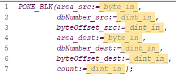
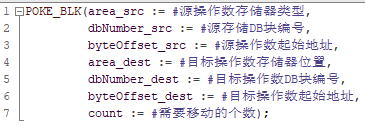

        <h1>S7-1200 PLC 电控学习笔记

    针对“S7-1200(main)”视频课程及个人总结

## 目录

- [1 绪论](#1绪论第一节)

    - [1.1 硬件介绍](#11-硬件介绍第二节)

    - [1.2 TIA博图软件的基本使用](#12-tia博图软件的基本使用第三节)

    - [1.3 S7-1200 PLC 基础知识](#13-s7-1200-plc-基础知识第四节)

- [2.指令学习](#2指令学习第五节)

    - [2.1 基本位逻辑指令](#21-基本位逻辑指令第六节)

    - [2.2 定时器与计数器指令](#22-定时器与计数器指令第七节)

    - [2.3 比较指令与函数指令](#23-比较指令与函数指令第八节)

    - [2.4 转换指令与移动指令](#24-转换指令与移动指令第九节)

    - [2.5 逻辑运算指令与移位指令](#25-逻辑运算指令与移位指令第十节)

- [3.FB、FC使用说明](#3fbfc使用说明第十一节)

- [4.功能应用](#4功能应用第十二节)

    - [4.1 PLC通信](#41plc通信)

        - [4.1.1 MODBUS通信](#411-modbus通信第十三节)

        - [4.1.2 S7通信](#412-s7通信第十四节)

        - [4.1.3 profinet通信](#413-profinet通信第十五节)

    - [4.2 运动控制](#42运动控制)

        - [4.1.1 MODBUS通信](#421-运动控制组态第十六节)

        - [4.1.2 S7通信](#422-运动控制指令第十七节)

- [附录](#附录)

    - [（1）网盘链接](#1网盘链接)

    - [（2）基本信息](#2基本信息)

## 1.绪论（第一节）
&emsp;&emsp;[西门子股份公司](https://www.siemens.com/cn/zh.html)是一家专注于工业、基础设施、交通和医疗领域的科技公司。从更高效节能的工厂、更具韧性的供应链、更智能的楼宇和电网，到更清洁、更舒适的交通以及先进的医疗系统，西门子致力于让科技有为，为客户创造价值。通过融合现实与数字世界，西门子赋能客户推动产业和市场变革，帮助数十亿计的人们，共创每一天。

&emsp;&emsp;其中，S7-1200与S7-200SMART是现今西门子应用小型的自动化离散控制系统中的主要两款控制器。

    

| 硬件结构 | S7-200SMART | S7-1200 |
| :--------: |:--------: | :--------: |
| 集成通信口 | 以太网接口+RS485 | 以太网接口 |
| 信号板扩展（SB） | 支持 | 支持 |
| 最大扩展模块数 | 6个扩展模块 | 8个信号模块+3个通信模块 |
| 模拟量输入输出 | 不自带 | 自带2路模拟量输入功能 |
| 数字量输入 | 支持源型/漏型接法 | 支持源型/漏型接法 |
| 数字量输出 | 输出高电平信号 | 输出高电平信号 |

| 功能与程序结构 | S7-200SMART | S7-1200 |
| :--------: | :--------: | :--------: |
| 通信能力 | 支持S7、open、Modbus通信，DP从站、profinet通信 | 除S7-200SMART所支持的功能外，还可支持远程I/O，DP主站通信等 |
| 高速脉冲输出功能 | 支持3轴高速脉冲输出 | 支持4轴高速脉冲输出 |
| 过程控制功能 | 最多支持8个PID | 最多支持16个PID |
| 运算速度 | 0.15微秒 | 0.08微秒 |
| 数据断电保持方面 | 10KB的保存性储存器 | 10KB的保存性储存器 |
| 程序块 | 主程序、子程序、中断程序 | OB块、FB块、FC块、DB块 |
| 数据类型 | 只有基本的数据类型 | 除基本数据类型之外还有一些复杂的数据类型，参数数据类型等 |

&emsp;&emsp;TIA 博途软件将所有的自动化软件工具都统一到一个开发环境中，可以在统一开发环境组合几乎所有的西门子可编程控制器、人机界面和驱动装载。

    

&emsp;&emsp;全部技术可见官方文件[S7-1200 PLC 技术手册 EasyPlus](https://s7-1200plc-easyplus.readthedocs.io/zh-cn/sphinx-doc/index.html)

### 1.1 硬件介绍（第二节）

    

&emsp;&emsp;型号CPU xxxxC：紧凑型

&emsp;&emsp;DC/DC/DC：直流24V

&emsp;&emsp;AC/DC/xx：交流220V（RLY主要影响触点的带载能力）

&emsp;&emsp;CPU控制方式有以下分类：

    

&emsp;&emsp;工作存储组：相当于计算机的RAM，程序运算在工作存储区。

&emsp;&emsp;装载存储区：相当于计算机的ROM，程序保存在装载存储区。

&emsp;&emsp;保持性存储区：针对断电保持的数据存储。

&emsp;&emsp;远程I/O和扩展的数据走的都是过程映像区。

    

&emsp;&emsp;信号模块：数字量输入输出模块、模拟量输入输出模块统称信号模块，在PLC右侧扩展。

    

&emsp;&emsp;信号板、通信模块及信号模块扩展均可查询[S7-1200 PLC 产品手册](https://strcsstatic.blob.core.chinacloudapi.cn/downloadcenterproduction/Upload/DocFiles/20096/3401/tb/4080_2023.pdf
)。

    

&emsp;&emsp;在组装的PLC右上角可以看到S7-1200字样，代表着该PLC为S7-1200类控制器；

&emsp;&emsp;在组装的PLC右侧中间可以看到CPU 1214C DC/DC/DC字样，代表着该CPU型号为紧凑型代码1214，使用直流24V电源供电；

&emsp;&emsp;在拆解后的PLC图中可以看到，中间部位可以扩展信号板，左侧部位已经扩展一块CM 1241通信模块，用于RS232通信。

### 1.2 TIA博图软件的基本使用（第三节）

&emsp;&emsp;本项目教研室使用TIA Portal V15.1软件，打开软件后呈现初始Portal视图（如下图所示），可点击右侧中部“创建”按钮创建新项目。

    

&emsp;&emsp;创建新项目或打开历史项目后，则呈现如下图所示页面，可点击中间下部“打开项目视图”按钮或左下角“项目视图”按钮跳转至项目视图。

    

&emsp;&emsp;初始项目如下图所示。

    

&emsp;&emsp;点击“设备”栏“项目名称”下属的“添加新设备”按钮，可根据自身需要选择CPU（如下图所示）。组内裕富一块CPU 1214C DC/DC/DC PLC（214-1AG40-0XB0），可进行调试学习。

    

&emsp;&emsp;选择CPU后，软件会自动生成CPU信息（如下图所示）。从该CPU可以看出，该CPU可在左侧扩展3块通信模块、中间扩展1块信号板、右侧扩展8块信号模块。从右侧“硬件目录”框下可以拉取所需要扩展的模块。组内配套通信模块为CM 1241（241-1AH32-0XB0）以进行RS232通信。

    

&emsp;&emsp;程序主要可以通过“设备”栏“项目名称”下属的“程序块”进行查看，初始只有一个“main”程序块（如下图所示）。点击“添加新块”按钮，可以添加新的程序块。程序块主要分为四类：OB组织块、FB函数块、FC函数、DB数据块。可用三种语言编写：LAD、FBD、SCL。

    

### 1.3 S7-1200 PLC 基础知识（第四节）

&emsp;&emsp;存储区地址分类：

| 存储区 | 说明 |
| :--------: | :--------: |
| 过程映像输入（I） | 从扫描周期开始从物理输入复制（按钮） |
| 物理输入（I_:P）| 立即读取CPU的SB和SM的物理输入点 |
| 过程映像输出（Q） | 在扫描周期开始后复制到物理输出 |
| 物理输出（Q_:P）| 立即写入CPU、SB、SM上的物理输出点 |
| 位存储器（M） | 控制盒数据存储器（中间继电器） |
| 临时存储区（L） | 存储块的临时数据，这些数据仅在该块本地范围有效 |
| 数据块（DB） | 数据存储器，同时也是FB的参数存储器 |

&emsp;&emsp;寻址方式：

&emsp;&emsp;&emsp;&emsp;8位=1字节&emsp;16位=1字&emsp;32位=双字

&emsp;&emsp;&emsp;&emsp;I0.0~I0.7 IB0

&emsp;&emsp;&emsp;&emsp;I1.0~I1.7 IB1

&emsp;&emsp;&emsp;&emsp;TB0和IB1 IW0

&emsp;&emsp;&emsp;&emsp;IW0和IW2 ID0

&emsp;&emsp;&emsp;&emsp;FC块里面用形参，FC外用实参

&emsp;&emsp;数据类型用于指定数据元素的大小和格式，在定义变量时需要设置变量的数据类型，在使用指令、函数、函数块时，需要按照操作数要求的数类型使用合适的变量。

&emsp;&emsp;S7-1200中CPU的数据类型分为以下：基本数据类型、复杂数据类型、PLC数据类型（UDT）、VARIANY数据类型、系统数据类型、硬件数据类型。

<table>
  	<tr>
		<td align="center" >名称</td>
		<td align="center" >数据类型</td>
        <td align="center" >大小（bit）</td>
        <td align="center" >范围</td>
        <td align="center" >常量输入实例</td>
	</tr>
	<tr>
		<td align="center"  rowspan="5">无符号整型 （位或位系列）</td>
		<td align="center" >BOOL</td>
        <td align="center" >1</td>
        <td align="center" >0~1</td>
        <td align="center" >TRUE、FALSE、0、1</td>
	</tr>
	<tr>
		<td align="center" >BYTE</td>
        <td align="center" >8</td>
        <td align="center" >16#00~16#FF</td>
        <td align="center" >16#12、16#AB</td>
	</tr>
    <tr>
		<td align="center" >WORD</td>
        <td align="center" >16</td>
        <td align="center" >16#0000~16#FFFF</td>
        <td align="center" >16#1234、16#ABCD</td>
	</tr>
    <tr>
		<td align="center" >DWORD</td>
        <td align="center" >32</td>
        <td align="center" >16#00000000~16#FFFFFFFF</td>
        <td align="center" >16#1234ABCD</td>
	</tr>
    <tr>
		<td align="center" >CHAR</td>
        <td align="center" >8</td>
        <td align="center" >16#00~16#FF</td>
        <td align="center" >'A'、'f'、'@'</td>
	</tr>
    <tr>
		<td align="center"  rowspan="6">整型数据</td>
		<td align="center" >SINT</td>
        <td align="center" >8</td>
        <td align="center" >-128~127</td>
        <td align="center" >-100、100</td>
	</tr>
	<tr>
		<td align="center" >INT</td>
        <td align="center" >16</td>
        <td align="center" >-32768~32767</td>
        <td align="center" >-1000、1000</td>
	</tr>
    <tr>
		<td align="center" >DINT</td>
        <td align="center" >32</td>
        <td align="center" >-2147483648~2147483647</td>
        <td align="center" >-12342354、12342354</td>
	</tr>
    <tr>
		<td align="center" >USINT</td>
        <td align="center" >8</td>
        <td align="center" >0~255</td>
        <td align="center" >123</td>
	</tr>
    <tr>
		<td align="center" >UINT</td>
        <td align="center" >16</td>
        <td align="center" >0~65535</td>
        <td align="center" >12312</td>
	</tr>
    <tr>
		<td align="center" >UDINT</td>
        <td align="center" >32</td>
        <td align="center" >0~4294967295</td>
        <td align="center" >12341234</td>
	</tr>
    <tr>
		<td align="center"  rowspan="2">浮点数 （实数）</td>
		<td align="center" >REAL</td>
        <td align="center" >32</td>
        <td align="center" >±1.175495×10^-38~±3.402823×10^38</td>
        <td align="center" >123.456、-3.4×10^-2</td>
	</tr>
	<tr>
		<td align="center" >LRAEAL</td>
        <td align="center" >64</td>
        <td align="center" >±2.2250738585072014×10^-308~ ±1.7976931348623158×10^308</td>
        <td align="center" >12345.123456789</td>
	</tr>
    <tr>
		<td align="center"  rowspan="3">时间和日期 数据类型</td>
		<td align="center" >TIME</td>
        <td align="center" >32</td>
        <td align="center" >T#-24D_20d_31m_23s_648ms~ T#24d_20h_31m_23s_647ms</td>
        <td align="center" >T#50m_30s、T#1d_2h_15m_30s_45ms</td>
	</tr>
	<tr>
		<td align="center" >日期</td>
        <td align="center" >16</td>
        <td align="center" >D#1990-1-1~D#2168-12-31</td>
        <td align="center" >D#2017-11-11</td>
	</tr>
    <tr>
		<td align="center" >TIME_OF_DAY</td>
        <td align="center" >32</td>
        <td align="center" >TOD#0:0:0~TOD#23:59:59.999</td>
        <td align="center" >TOD#10::20:30.400</td>
	</tr>
    <tr>
		<td align="center"  rowspan="2">字符</td>
		<td align="center" >Char</td>
        <td align="center" >8</td>
        <td align="center" >16#00~16#FF</td>
        <td align="center" >'A'、'T'、'@'</td>
	</tr>
	<tr>
		<td align="center" >WChar</td>
        <td align="center" >16</td>
        <td align="center" >16#0000~16#FFFF</td>
        <td align="center" >亚洲字符等</td>
	</tr>
    <tr>
		<td align="center"  rowspan="2">字符串</td>
		<td align="center" >String</td>
        <td align="center" >n+2</td>
        <td align="center" >n=(0到254字节)</td>
        <td align="center" >'ABCD'</td>
	</tr>
	<tr>
		<td align="center" >WString</td>
        <td align="center" >n+2</td>
        <td align="center" >n=(0到65534字节)</td>
        <td align="center" >'abc123@.com'</td>
	</tr>
</table>

&emsp;&emsp;全部数据类型都应当准确分辨与使用。

## 2.指令学习（第五节）

&emsp;&emsp;程序块分类：

<table align="center">
  	<tr>
		<td align="center" >块</td>
		<td align="center" >描述</td>
	</tr>
	<tr>
		<td align="center" >组织块（OB）</td>
        <td align="left" >是CPU操作系统与用户程序的接口，决定用户程序的结构。被操作系统自动调用，在使用中有中断组织块、启动组织块等。使用时必须有OB1组织块，操作系统会每个扫描周期执行一次OB1。</td>
	</tr>
	<tr>
		<td align="center" >函数块（FB）</td>
        <td align="left" >用户编写的包含经常使用的功能的子程序，有专用背景数据块。运行时需要调用各种参数，于是就产生了背景数据块DB，所以需要用到的数据就存储在DB块中，即使结束调用，数据也不丢失。</td>
	</tr>
    <tr>
		<td align="center" >函数（FC）</td>
        <td align="left" >用户编写的包含经常使用的功能的子程序，无专用背景数据块，运行时产生临时变量执行结束后数据丢失，不具备存储功能。</td>
	</tr>
    <tr>
		<td align="center" >背景数据块（DB）</td>
        <td align="left" >用于保存FB的输入变量，输出变量和静态变量，其数据在编译时自动生成。</td>
	</tr>
    <tr>
		<td align="center" >全局数据块（DB）</td>
        <td align="left" >用于储存用户的数据区域，供所有代码块访问</td>
	</tr>
</table>

&emsp;&emsp;常用程序块：

&emsp;&emsp;&emsp;&emsp;OB1：循环执行主程序 => Main

&emsp;&emsp;&emsp;&emsp;OB30：循环中断程序 => Cyclic interrupt

&emsp;&emsp;&emsp;&emsp;OB100：初始化程序（复位、赋初始值） => Startup

&emsp;&emsp;OB1是用户程序的主程序，CPU操作系统会在每个扫描周期，循环扫描执行OB1中的程序，而对于FB或者FC程序块，则需要在OB1中调用后才会被PLC扫描执行（如下图所示）。

    

&emsp;&emsp;OB30：通过“循环中断”OB，可以定期启动程序，而无须执行循环程序。可以在本对话框或在该OB的属性中定义时间间隔。（复制于博途V15.1“添加新块”处介绍）

&emsp;&emsp;OB100：“启动”OB将在 PLC 的工作模式从STOP切换为RUN时执行一次。完成后，将开始执行主“程序循环“OB。（复制于博途V15.1“添加新块”处介绍）

&emsp;&emsp;S7-1200 PLC的指令分为基本指令、扩展指令、工艺指令、通信指令等。基本指令是学习S7-1200 PLC指令系统中最基础的指令，包括：位逻辑指令、定时器指令、计数器指令、比较操作、数学函数、移动操作、转换操作、程序控制操作、字逻辑运算指令、移位和循环指令等10部分指令。

    
    
    

### 2.1 基本位逻辑指令（第六节）

&emsp;&emsp;位逻辑指令包含触点、线圈、取反、置位和复位、置位域和复位域、置位优先和复位优先以及沿脉冲指令。

    

1. 触点与赋值指令

&emsp;&emsp;&emsp;&emsp;触点指令分为常开触点和常闭触点指令，使用时即可单一使用，也可多个进行逻辑“与”和逻辑“或”运算。

&emsp;&emsp;&emsp;&emsp;赋值指令则用于输出前面的逻辑运算结果。

    

2. 置位与复位指令

&emsp;&emsp;&emsp;&emsp;置位与复位指令是当逻辑运算结果（RLO）的值为1时，执行置位或复位指令。

&emsp;&emsp;&emsp;&emsp;&emsp;&emsp;置位指令：把存储器的状态设置为1。

&emsp;&emsp;&emsp;&emsp;&emsp;&emsp;复位指令：把存储器的状态设置为0。

    

    

    

3. 沿脉冲指令

&emsp;&emsp;1）扫描操作数信号上升沿（下降沿）指令

    

&emsp;&emsp;注释：用于检查单个变量的沿，指令上方的操作数为待检测的变量，指令下方的操作数作为上一个扫描周期结果，指令右侧的输出为沿输出，接通时间为一个扫描周期时间。

&emsp;&emsp;2）在信号上升沿（下降沿）置位操作数

    

&emsp;&emsp;注释：用于检测指令前的能流结果的沿，指令上方的操作数为沿输出，指令下方的操作数为上一扫描周期结果，指令前后的能流保持不变。

&emsp;&emsp;3）扫描RLO的信号上升沿（下降沿）指令

    

&emsp;&emsp;注释：用于检测指令前的能流结果的沿，指令下方的操作数为上一扫描周期结果，指令右方为沿输出，和第一个沿指令不同之处在于该指令可检测多个变量与/或/非的结果的沿。该指令效果等于第二个沿指令。

&emsp;&emsp;4）检测信号上升沿（下降沿）指令

     

&emsp;&emsp;注释：该指令为一个FB块，并且是唯一可以在SCL中使用的，所以主要用在FB的多重背景或SCL编程中，CLK为待检查的变量或能流，Q为沿输出，上一扫描周期结果位于背景数据块中。

### 2.2 定时器与计数器指令（第七节）

&emsp;&emsp;定时器指令主要用于实现延时功能，在S7-1200 CPU提供了四种IEC-TIME的定时器，分别为TP型、TON型、TOF型以及TONR型。

    

&emsp;&emsp;常用定时器为TON型定时器和TOF型定时器。

&emsp;&emsp;定时器指令若在FC块中使用会自动生成一个DB块（可在“程序块”-“系统块”-“程序资源”查看），因此可以类比于FB块。也可以不生成，自主设置。

    

&emsp;&emsp;TP定时器可用于生成固定时间输出的信号。当定时器的使能端产生沿脉冲触发时，定时器的Q为1的时间等于定时器所指定的时间。

    

&emsp;&emsp;TON定时器用于实现接通延时的功能。当定时器的驱动条件满足后，定时器开始延时。当延时时间等于设定值后，定时器输出端Q输出为1；若定时器的驱动条件断开，则定时器输出端Q复位。

    

&emsp;&emsp;TOF定时器用于实现断开延时的功能。当定时器的驱动条件满足后，定时器输出端Q输出为1；若定时器的驱动条件断开，定时器输出端Q保持为1，定时器开始延时。当演示过程中，当前值与设定值相等时，定时器输出端Q复位。 

    

&emsp;&emsp;TONR定时器功能与TON定时器功能基本相同。不同之处在于该定时器会对定时器延时的时间做保存，需要复位时要将定时器的R端设置为1。

    

&emsp;&emsp;当自主设置存储DB块时，具体状态可由两种性质存储，一种是单IEC_Timer，一种是数组（数据类型仍为IEC_Timer）。

    

&emsp;&emsp;若在FB块中运用定时器指令，则运用“多重实例”可将其统一保存与背景DB块中。但当在main程序块中使用该FB块时，仍会产生一个全局DB块。

    

&emsp;&emsp;计数器指令与定时器指令相似。当计数器的驱动条件满足后，计数器开始计数。当计算后的数字等于设定值后，计数器输出端Q输出为1.

    

    

    

    

&emsp;&emsp;其中，具体字母可由下表表示。

| 字母 | 代表含义 |
| :--------: | :--------: |
| CU | 输入增加信号 |
| CD | 输入减少信号 |
| Q | 输出信号 |
| QU | 增加完成输出 |
| QD | 减少完成输出 |
| PV | 最终值或初始值 |
| CV| 计数器实时存储数值 |
| R | 复位 |
| LD | 发送当前数值给CV |

&emsp;&emsp;注意：计数器指令中间的数据类型一定要与设置值匹配。

### 2.3 比较指令与函数指令（第八节）

1. 比较指令

&emsp;&emsp;S7-1200 CPU提供了丰富的比较指令，使用时不单单可对基本数据类型的数据进行比较（触点比较），也可对一些复杂的数据类型的数据进行比较（区间范围比较）。当比较结果成立时，输出结果为1。

&emsp;&emsp;1）触点比较指令

&emsp;&emsp;该指令用于判断比较数与被比较数之间是否符合运算符的要求。

    

&emsp;&emsp;2）范围比较指令

&emsp;&emsp;该指令用于判断比较数是否在两个被比较数之间，还是在被比较数之外。数据类型上只支持数值的比较，不支持时间和日期格式的比较。

    

&emsp;&emsp;3）其他指令

&emsp;&emsp;可通过官方文件[S7-1200 PLC 技术手册 EasyPlus](https://s7-1200plc-easyplus.readthedocs.io/zh-cn/sphinx-doc/index.html)自行学习，使用原理与上述指令大致相同。

2. 数学函数指令

&emsp;&emsp;1）四则运算指令

&emsp;&emsp;该指令是常用的数学函数运算指令，主要用于对基本的数据类型进行计算。

    

&emsp;&emsp;在数学函数指令中，所有的数据类型要进行匹配，其中Int数据类型的3/2得不出Real数据类型的1.5，只有real类型3.0/2.0=1.5。

&emsp;&emsp;点击指令块下方的黄色按钮即可增加管脚（输入的数字）。

&emsp;&emsp;ENO使能输出则是在计算错误的情况（如除数为0、结果溢出）下无法运行。关闭则可以强制运行。点击程序块后点击鼠标右键即可打开和关闭ENO。

    

&emsp;&emsp;2）递增与递减指令

&emsp;&emsp;该指令指执行一次指令后，会在本身的结果中加1或减1，因此可以用于实现计数功能。

    

&emsp;&emsp;3）计算指令

&emsp;&emsp;该指令可用于编写计算基本数据类型数据的计算公式。

    

&emsp;&emsp;4）最大值与最小值指令

&emsp;&emsp;该指令可用于找出数据中心的最大值和最小值。

    

&emsp;&emsp;5）其他指令

&emsp;&emsp;可通过官方文件[S7-1200 PLC 技术手册 EasyPlus](https://s7-1200plc-easyplus.readthedocs.io/zh-cn/sphinx-doc/index.html)自行学习，使用原理与上述指令大致相同。

### 2.4 转换指令与移动指令（第九节）

&emsp;&emsp;数据处理指令中包含了数据移动指令和数据转换指令，数据移动指令可用于对存储器进行赋值或是把一个存储器的数据移动到另外的存储器中，数据转换指令用于把不同数据类型的数据转换为相同的数据类型。

    

    

1. 数据移动指令

&emsp;&emsp;**单值移动指令**在应用的过程中，用于对存储器进行赋值或吧一个存储器的值复制到另外的一个存储器当中，移动过程中不会更改源数据。常用的移动指令有单值的移动指令、块移动指令、填充指令及高低字节交换指令及读取域和写入域指令。

    

&emsp;&emsp;注意：

&emsp;&emsp;&emsp;&emsp;（1）传送指令上并未规定源操作属于目标操作数的数据类型，使用是可以不同数据类型的数据进行传送，但需要注意的是并不是适合所有的数据类型，如实数的数据类型智能传送给实数数据类型的变量。

&emsp;&emsp;&emsp;&emsp;（2）若从复制的数据超出了存储器所能存储的范围，则存储的数据为复制的数据减去存储所能存储的最大值后所得到的值。

&emsp;&emsp;**块移动指令**又称为存储区移动指令，用于将源存储区的数据移动到目标存储区，IN和OUT是待复制的源区域和目标区域中的首个元素（并不要求是数组中的第一个元素）。

    

&emsp;&emsp;图中程序译为将“数据处理DB”的数据块中的“数据1”数组中从[2]开始向下数3位，移动到“数据处理DB”的数据块中的“数据3”数组中从[1]开始向下数3位。

&emsp;&emsp;即将左图数据1[2]、数据1[3]、数据1[4]中的数据按顺序移动到数据3[1]、数据3[2]、数据3[3]中。

    
    

&emsp;&emsp;注：该指令只适合针对于数据块中的数组进行数据的移动。

&emsp;&emsp;若需要实现对非数据块的数据实现批量移动，则可使用SCL编程中的**POKE_BLE指令**进行实现。

    
    

&emsp;&emsp;修改后代码如下图所示：

    

    POKE_BLK
        (
            area_src := #源操作数存储器类型,
            dbNumber_src := #源存储DB块编号,
            byteOffset_src := #源操作数起始地址,
            area_dest := #目标操作数存储器位置,
            dbNumber_dest := #目标操作数DB块编号,
            byteOffset_dest := #目标操作数起始地址,
            count := #需要移动的个数
        );
&emsp;&emsp;目标操作数类型如下表所示： 

<table align="center">
  	<tr>
		<td align="center" >位数</td>
		<td align="center" >意义</td>
	</tr>
	<tr>
		<td align="center" >16#81</td>
		<td align="center" >Input</td>
	</tr>
    <tr>
		<td align="center" >16#82</td>
		<td align="center" >Output</td>
	</tr>
    <tr>
		<td align="center" >16#83</td>
		<td align="center" >位存储区</td>
	</tr>
    <tr>
		<td align="center" >16#84</td>
		<td align="center" >DB</td>
	</tr>
</table>

    

&emsp;&emsp;使用**数据填充指令**可以对数组中连续的元素写入相同的数值，要求输出OUT必须使用数组形式的变量。

    

&emsp;&emsp;若需要实现对输出存储器或是M存储器进行数据的填充，则需要自行编程。

    

    IF #开始填充 = 1 AND #需要填入数据的个数 > 0 THEN
        #temp1 := #目标操作数起始位置;
        FOR #i：= 1 TO #需要填入数据的个数 DO
            POKE(area := #目标操作数类型, dbNumber := #DB块地址, byteOffset := #temp1, value := #填入数据)；
            #temp1 := #temp1 + 1;
        END_FOR;
    END_IF;

    

2. 转换指令

&emsp;&emsp;转换指令包含转换值指令、浮点数转整数指令、缩放与标准化指令。在实际应用中常用转换指令有：转换值指令、缩放与标准化指令。缩放与标准化指令常用于模拟量换算。

    

&emsp;&emsp;支持转换后的数据类型会因选择的被转换的数据的数据类型不同而不同。

    

&emsp;&emsp;图中右侧转换值指令若左侧“数据处理DB”.数据4[0]赋值为20.5，INT输出仅转换为20。（X.5会转换为X）

&emsp;&emsp;1）标准化指令

&emsp;&emsp;标准化指令（NORM_X）用于标准化通过参数MIN和MAX指定的范围内的参数VALUE，把其标定为0% ~ 100%范围内。

    OUT = (VALUE - MIN)/(MAX - MIN)&emsp;&emsp;0.0 <= OUT <= 1.0

    
    

&emsp;&emsp;2）缩放指令

&emsp;&emsp;缩放指令（SCALE_X）用于按参数MIN和MAX所指定的数据类型和值范围对标准化的实参数VALUE进行标定。

    OUT = VALUE * (MAX - MIN) + MIN&emsp;&emsp;0.0 <= OUT <= 1.0

    
    

&emsp;&emsp;3）标准化与缩放指令

&emsp;&emsp;可搭配使用进行模拟量的输出。

    

### 2.5 逻辑运算指令与移位指令（第十节）

&emsp;&emsp;逻辑指令包含字逻辑“与”、字逻辑“或”、字逻辑“异或”、取反等指令。

    

&emsp;&emsp;指令结果可如下表所示：

<table align="center">
  	<tr>
		<td align="center" >指令类型</td>
		<td align="center" >MW10</td>
        <td align="center" >MW11</td>
        <td align="center" >MB12</td>
        <td align="center" >指令运算结果</td>
	</tr>
	<tr>
		<td align="center" >AND（字逻辑“与”）</td>
		<td align="center" >10101100</td>
        <td align="center" >01001101</td>
        <td align="center" >空</td>
        <td align="center" >00001100</td>
	</tr>
    <tr>
		<td align="center" >OR（字逻辑“或”）</td>
		<td align="center" >10101100</td>
        <td align="center" >01001101</td>
        <td align="center" >空</td>
        <td align="center" >11101101</td>
	</tr>
    <tr>
		<td align="center" >XOR（字逻辑“异或”）</td>
		<td align="center" >10101100</td>
        <td align="center" >01001101</td>
        <td align="center" >空</td>
        <td align="center" >11100001</td>
	</tr>
    <tr>
		<td align="center" >INV（取反）</td>
		<td align="center" >空</td>
        <td align="center" >空</td>
        <td align="center" >10101100</td>
        <td align="center" >01010011</td>
	</tr>
</table>

&emsp;&emsp;实例：现有8台电机，每台电机都使用单按钮启停的控制方式，但要求8台电机中只允许一台电机可以运行。若需要切换电机的运行，需保证运行电机停止后才可进行启动。

    

&emsp;&emsp;移位指令暂时未涉及，可通过官方文件[S7-1200 PLC 技术手册 EasyPlus](https://s7-1200plc-easyplus.readthedocs.io/zh-cn/sphinx-doc/index.html)自行学习。

## 3.FB、FC使用说明（第十一节）

1. 函数FC块

&emsp;&emsp;1）概述

&emsp;&emsp;FC块是不含存储区的代码块，常用于对一组输入值执行特定运算或者执行一些使用位逻辑运算执行独立的控制。FC块也可以在程序中的不同位置多次调用，简化了对经常重复发生的任务的编程。建立FC块可建立带形式参数的FC块和不带形式参数的FC块。

&emsp;&emsp;FC块没有相关的背景数据块（DB块），没有可以存储块参数值的数据存储器。因此在调用函数时，必须给所有形参分配实参。对于用于FC块的临时数据，FC块采用了局部数据堆栈，不全局保存临时数据。若要永久性存储数据，可将输出值赋给全局存储器位置，如M存储器或全局DB块。

    
    

&emsp;&emsp;2）接口区

&emsp;&emsp;每个FC块都有对应的接口区，通过接口区建立相应的变量，在编写程序时用建立好的变量符号进行编程，以便在其他块中能够重复的调用。

    

<table align="center">
  	<tr>
		<td align="center" >接口类型</td>
		<td align="center" >读写访问</td>
        <td align="center" >作用描述</td>
	</tr>
	<tr>
		<td align="center" >Input</td>
        <td align="center" >只读</td>
        <td align="left" >调用函数时，将用户程序数据传递到FC块中，实参可以为常数。</td>
	</tr>
	<tr>
		<td align="center" >Output</td>
        <td align="center" >读写</td>
        <td align="left" >调用函数时，将FC块执行结果传递到用户程序中，实参不能为常数。</td>
	</tr>
    <tr>
		<td align="center" >In/Out</td>
        <td align="center" >读写</td>
        <td align="left" >接收数据后进行运算，然后将执行结果返回，实参不能为常数。</td>
	</tr>
    <tr>
		<td align="center" >Temp</td>
        <td align="center" >读写</td>
        <td align="left" >仅在FC块调用时生效，用于存储临时中间结果的变量。</td>
	</tr>
    <tr>
		<td align="center" >Constantt</td>
        <td align="center" >只读</td>
        <td align="left" >声明常量符号名后，FC块中可以使用符号名代替常量。</td>
	</tr>
</table>

&emsp;&emsp;在调用FC时，将执行FC中的程序，使用FC编程时需要注意以下事项：

&emsp;&emsp;&emsp;&emsp;（1）如果FC的接口参数进行了增加或减少或修改了对应变量的数据类型，则必须编译整个程序并更新调用块，然后重新下载，下载是执行一致性下载。

&emsp;&emsp;&emsp;&emsp;（2）FC的形式参数在使用时只能通过符号访问，不能用绝对地址访问。

2. 函数块FB块

&emsp;&emsp;1）概述

&emsp;&emsp;与FC块相比，调用函数块FB块时，需要为之分配背景DB块。该背景DB块用于存储块的参数。FB块在使用时通常用于完成一些组件类程序的编写。由于FB块在调用时，会分配对应的的DB块，所以对于带形式参数的FB块，在调用时可以不对FB块上的管脚赋予实参。

    

&emsp;&emsp;2）接口区

&emsp;&emsp;每个FB块都带有接口区，相对于FC的接口区来讲，在FB块的接口区中增加了静态变量(Static)的数据类型。使用该变量可存储运行的中间结果，相比与临时变量，当结束块调用后，数据会保持在对应的背景DB中，不会丢失。

    

<table align="center">
  	<tr>
		<td align="center" >接口类型</td>
		<td align="center" >读写访问</td>
        <td align="center" >作用描述</td>
	</tr>
	<tr>
		<td align="center" >Input</td>
        <td align="center" >只读</td>
        <td align="left" >调用函数时，将用户程序数据传递到FB块中，实参可以为常数。</td>
	</tr>
	<tr>
		<td align="center" >Output</td>
        <td align="center" >读写</td>
        <td align="left" >调用函数时，将FB块执行结果传递到用户程序中，实参不能为常数。</td>
	</tr>
    <tr>
		<td align="center" >In/Out</td>
        <td align="center" >读写</td>
        <td align="left" >接收数据后进行运算，然后将执行结果返回，实参不能为常数。</td>
	</tr>
    <tr>
		<td align="center" >Static</td>
        <td align="center" >读写</td>
        <td align="left" >不参与参数传递，用于存储中间过程值，可被其他程序块访问。</td>
	</tr>
    <tr>
		<td align="center" >Temp</td>
        <td align="center" >读写</td>
        <td align="left" >仅在FB块调用时生效，用于存储临时中间结果的变量。</td>
	</tr>
    <tr>
		<td align="center" >Constantt</td>
        <td align="center" >只读</td>
        <td align="left" >声明常量符号名后，FB块中可以使用符号名代替常量。</td>
	</tr>
</table>

## 4.功能应用（第十二节）

&emsp;&emsp;S7-1200对变频器的控制中，除了通过端子的方式控制外，还可通过通信的方式控制。

&emsp;&emsp;使用通信的方式控制变频器主要可通过以下几种通信协议来实现：

&emsp;&emsp;&emsp;&emsp;（1）ASCⅡ协议

&emsp;&emsp;&emsp;&emsp;（2）MODBUS RTU协议

&emsp;&emsp;&emsp;&emsp;（3）USS协议

&emsp;&emsp;&emsp;&emsp;（4）DP协议

&emsp;&emsp;&emsp;&emsp;（5）PN协议

    

&emsp;&emsp;SMODBUS通信除了在变频器上使用以外，在一些智能仪表或是远程I/O模块以及PLC都可支持。

    

&emsp;&emsp;每个Modbus网段组多可有32个设备。当达到32个设备的限制时，必须使用中继器来扩展到下一个网段。

&emsp;&emsp;S7-1200集成有一到两个PN接口，通过该接口上可实现S7-1200 PLC之间的以太网通信功能。

&emsp;&emsp;使用时可以通过以下三种方式实现S7-1200PLC之间的以太网通信：

&emsp;&emsp;&emsp;&emsp;（1）S7通信

&emsp;&emsp;&emsp;&emsp;（2）OUC通信

&emsp;&emsp;&emsp;&emsp;（3）I/O设备通信

    

&emsp;&emsp;S7通信和I/O设备通信是S7-1200 PLC之间常用于的两种通信方式，而OUC通信主要针对于与第三方设备的通信。其中，OUC通信常用协议有TCP/IP协议、UDP协议以及ISO-ON协议。

&emsp;&emsp;通过PTO脉冲（PTO脉冲即为输入和输出占空比为50%的信号）的方式实现对步进或伺服实现位置控制是常见的一种控制方式。对于CPU的输出类型为晶体管输出型的CPU，一个CPU最多可实现4个PTO脉冲的输出。若使用的是继电器输出型的CPU，可通过扩展SB信号板来实现PTO脉冲的输出。

    

<table align=center>
    <tr>
		<td align="center" colspan="2">SB信号板类型</td>
		<td align="center" >订货号</td>
        <td align="center" >脉冲频率</td>
        <td align="center" >高速脉冲输出点个数</td>
	</tr>
    <tr>
		<td align="center"  rowspan="2">DO</td>
		<td align="center" >4×24VDC</td>
        <td align="center" >6ES7 222-1BD30-0XB0</td>
        <td align="center" >200KHz</td>
        <td align="center" >可提供4个高速脉冲输出点</td>
	</tr>
    <tr>
		<td align="center" >4×5VDC</td>
        <td align="center" >6ES7 222-1AD30-0XB0</td>
        <td align="center" >200KHz</td>
        <td align="center" >可提供4个高速脉冲输出点</td>
	</tr>
    <tr>
		<td align="center"  rowspan="3">DI/DO</td>
		<td align="center" >2DI/2×24VDC</td>
        <td align="center" >6ES7 223-0BD30-0XB0</td>
        <td align="center" >20KHz</td>
        <td align="center" >可提供2个高速脉冲输出点</td>
	</tr>
    <tr>
		<td align="center" >2DI/2×24VDC</td>
        <td align="center" >6ES7 223-3BD30-0XB0</td>
        <td align="center" >200KHz</td>
        <td align="center" >可提供2个高速脉冲输出点</td>
	</tr>
    <tr>
		<td align="center" >2DI/2×5VDC</td>
        <td align="center" >6ES7 223-3AD30-0XB0</td>
        <td align="center" >200KHz</td>
        <td align="center" >可提供2个高速脉冲输出点</td>
	</tr>
</table>

&emsp;&emsp;S7-1200中引入了工艺对象的概念，若需要实现对步进电机的控制，则需要首先组态工艺对象，每个运动轴对应一个工艺对象。工艺对象组态好后，可通过调用运动控制指令编写相应的控制程序。

    

&emsp;&emsp;触摸屏的添加使用可通过官方文件[S7-1200 PLC 技术手册 EasyPlus](https://s7-1200plc-easyplus.readthedocs.io/zh-cn/sphinx-doc/index.html)和视频自行学习。

### 4.1.PLC通信
#### 4.1.1 MODBUS通信（第十三节）

#### 4.1.2 S7通信（第十四节）

#### 4.1.3 profinet通信（第十五节）

### 4.2.运动控制
#### 4.2.1 运动控制组态（第十六节）

#### 4.2.2 运动控制指令（第十七节）

## 附录：
### （1）网盘链接

&emsp;&emsp;通过网盘分享的文件：PLC学习视频

&emsp;&emsp;链接: https://pan.baidu.com/s/1n_xGmJcDOixL_-6AZsJNnA

&emsp;&emsp;提取码: 6ncj

### （2）基本信息
&emsp;&emsp;徐化睿&emsp;24B918110

&emsp;&emsp;联系方式：15114511742

&emsp;&emsp;邮箱：1668385413@qq.com（QQ）

